#  Predict Iris Class with Classification Models

## Problem Statement

The purpose of this study is; Iris class was tried to predict from sepal length, sepal width, petal length and petal width.

## Dataset

Dataset is downloaded from [Kaggle](https://www.kaggle.com/uciml/iris).  Dataset has been manipulated by myself. It has **5 columns** and **151 rows with the header**.

## Methodology

In this project, as stated in the title, results were obtained through classifiaction methods such as ***Logistic Regression, K-Nearest Neighbors(KNN), Support Vector Classification (SVC), Gaussian Naive Bayes(GaussianNB), Decision Tree*** and ***Random Forest***.  You are free to visit [Machine Learning: Classification Models](https://medium.com/fuzz/machine-learning-classification-models-3040f71e2529) website for learn the methods better.

## Analysis

In the ***Plots*** file, there are the confusion matrix of the classification algorithms, ROC curve, the representations of the clusters obtained to form 1, 2, 3, 5, 10, 15 elements of the euclidean and manhattan distance in the K-NN algorithm and a visualization of the decision tree.

***RangeIndex: 150 entries, 0 to 149***

| # | Column | Non-Null Count | Dtype |
|--|--|--|--|
| 0 | sepal length | 150 non-null | float64
| 1 | sepal width | 150 non-null | float64
| 2 | petal length | 150 non-null | float64
| 3 | petal width | 150 non-null | float64
| 4 | iris | 150 non-null | object

### **Number of Duplicated Values:**

> **Number of duplicated values:**   3  
 
**After removing duplicate rows based on all columns.** 
> **Number of duplicated values:**   0

### Comparing Classification Algorithms

***Logistic Regression Confusion Matrix:***

     

> **Accuracy score: 0.9591836734693877**

The model predicted as ['Iris-virginica'].

---

***K-NN Confusion Matrix:***

    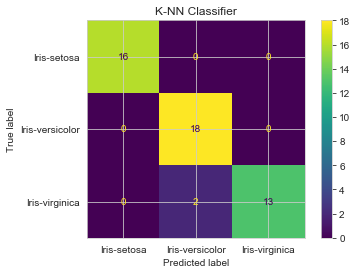 

> **Accuracy score: 0.9591836734693877**
> 
> **K-NN Score: 0.9591836734693877**

**Manhattan vs Euclidean Distance**

***Manhattan***

We use Manhattan distance, also known as city block distance, or taxicab geometry if we need to calculate the distance between two data points in a grid-like path. Manhattan distance metric can be understood with the help of a simple example.

|  |  |  |
|--|--|--|
| 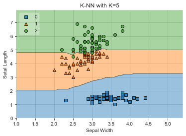 | 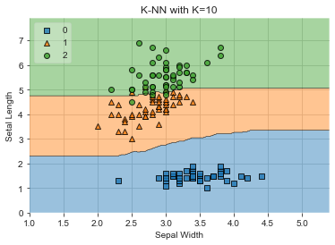 | 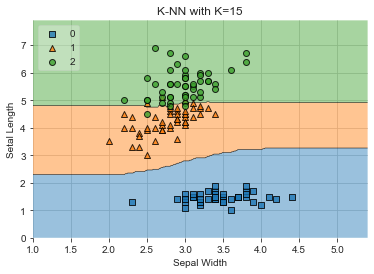 |

***Euclidean***

Euclidean distance is the straight line distance between 2 data points in a plane. It is calculated using the Minkowski Distance formula by setting ‘p’ value to 2, thus, also known as the L2 norm distance metric.

| 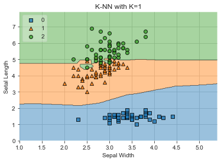 | 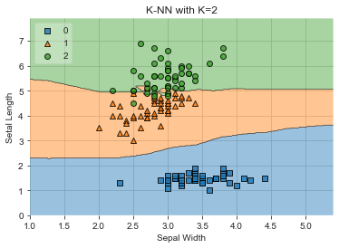 |  |
|--|--|--|
|  | 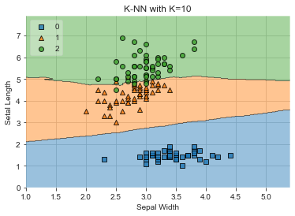 |  |

The model predicted as ['Iris-virginica'].

---

***SVC Confusion Matrix:***

    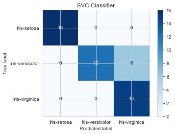 

> **Accuracy score: 0.8775510204081632**

The model predicted as ['Iris-versicolor'].

---

***Gaussian Naive Bayes Confusion Matrix:***

    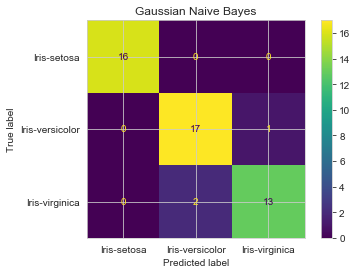 

> **Accuracy score: 0.9387755102040817**

The model predicted as ['Iris-virginica'].

---

***Decision Tree Classifier Confusion Matrix:***

     

> **Accuracy score: 0.9795918367346939**

The model predicted as ['Iris-virginica'].

---

***Random Forest Confusion Matrix:***

    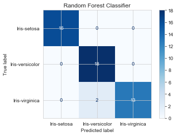 

> **Accuracy score: 0.9591836734693877**

The model predicted as ['Iris-virginica'].

---

### K-Fold Cross Validation

**Success Mean:**
 0.90875
 
**Success Standard Deviation:**
 0.03230443296033672

---

### Grid Search

**Best result:**
 0.9694736842105263
 
**Best parameters:**
{'C': 4, 'gamma': 0.1, 'kernel': 'sigmoid'}
 
> **Process took 53.17003583908081 seconds.**

### False Positive Rate and True Positive Rate

**False Positive Rate:**
[0. 0. 0. 1.]

**True Positive Rate:**
[0.     0.6875 1.     1.    ]

    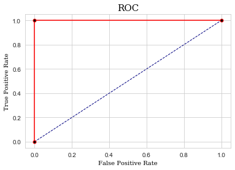 

## How to Run Code

Before running the code make sure that you have these libraries:

 - pandas 
 - matplotlib
 - seaborn
 - numpy
 - warnings
 - sklearn
 - time
 - mlxtend
 - pickle
    
## Contact Me

If you have something to say to me please contact me: 

 - Twitter: [Doguilmak](https://twitter.com/Doguilmak)
 - Mail address: doguilmak@gmail.com
 
